<div align="center">

# 🔍 AI/ML Project Deployment Template
*Scalable, Production-Ready YOLOv11 Object Detection Pipeline with Gradio Frontend and LitServe(for Live Server) & Runpod(Serverless) as Backend*

[](https://python.org)
[](https://docker.com)
[](https://github.com/Lightning-AI/litserve)
[](https://gradio.app)
[](https://runpod.io)
[](LICENSE)

## 🚀 **Powered By**

<div align="center" style="display: flex; justify-content: center; align-items: center; flex-wrap: nowrap; gap: 20px;">
  <a href="https://pytorch.org/">
    
  </a>
  <a href="https://docs.ultralytics.com/">
    
  </a>
  <a href="https://gradio.app/">
    
  </a>
  <a href="https://github.com/Lightning-AI/litserve">
    
  </a>
  <a href="https://runpod.io/">
    <picture>
      <source media="(prefers-color-scheme: dark)" srcset="https://mintlify.s3.us-west-1.amazonaws.com/runpod-b18f5ded/logo/runpod-logo-white.svg">
      
    </picture>
  </a>
</div>

<br>

*Built with industry-leading frameworks for production-ready ML deployment*

</div>

## 📋 Table of Contents

- [🎯 Purpose](#-purpose)
- [🏗️ Project Structure](#-project-structure)
- [🚀 Quick Start](#-quick-start)
- [📦 Installation](#-installation)
- [🔧 Configuration](#-configuration)
- [🌐 Usage Examples](#-usage-examples)
- [🚢 Deployment](#-deployment)
- [📖 API Documentation](#-api-documentation)
- [🧪 Testing](#-testing)
- [🐛 Troubleshooting](#-troubleshooting)
- [🤝 Contributing](#-contributing)

## 🎯 Purpose

This template provides a **production-ready foundation** for deploying YOLOv11 object detection models with clean separation between frontend and backend services. It demonstrates best practices for:

### ✨ **Key Features**
- 🔄 **Modular Architecture**: Separate UI and server applications with `app_ui.py` and `app_server.py`
- 🐳 **Multi-Platform Support**: LitServe for local/cloud deployment, RunPod for serverless
- ⚡ **High Performance**: Async processing with configurable batching and workers
- 🎨 **Modern UI**: Advanced Gradio interface with backend management
- 🔧 **Production Ready**: Comprehensive logging, health checks, and monitoring
- ⚙️ **Flexible Configuration**: YAML-based settings with environment overrides
- 📊 **Real-Time Processing**: Optimized inference pipeline with response formatting

### 🏗️ **Architecture**

```mermaid
graph TB
    subgraph "Frontend Layer"
        A[👤 User] --> B[🎨 Gradio UI<br/>app_ui.py]
        B --> C[Backend Manager<br/>Multiple Backends]
    end
    
    subgraph "Backend Layer"
        C --> D[⚡ LitServe API<br/>app_server.py]
        C --> E[☁️ RunPod Serverless<br/>app_server.py]
    end
    
    subgraph "Service Layer"
        D --> F[🔧 YOLO Service]
        E --> F
        F --> G[🤖 YOLOv11 Model<br/>Pipeline]
    end
    
    subgraph "Infrastructure"
        G --> H[📝 Configuration<br/>YAML + Environment]
        G --> I[📊 Logging & Monitoring]
        G --> J[🗄️ Model Cache]
    end
```


### 🎯 **Use Cases**
- **Real-time Object Detection**: Live image analysis with sub-second response
- **Scalable API Services**: Production-ready inference endpoints
- **Educational Projects**: Learn modern ML deployment patterns
- **Rapid Prototyping**: Quick model deployment and testing
- **Multi-Cloud Deployment**: Support for various cloud providers

---

## 🏗️ Project Structure

```
├── 📁 src/                          # Core application modules
│   ├── 📁 api/                      # API implementations
│   │   ├── litserve_api.py         # LitServe backend API
│   │   └── runpod_api.py           # RunPod serverless API
│   ├── 📁 services/                 # Business logic layer
│   │   └── yolov11_service.py      # Main YOLO service orchestrator
│   ├── 📁 pipelines/                # Model pipeline implementations
│   │   └── yolo.py                 # YOLOv11 model wrapper
│   ├── 📁 ui/                       # Frontend components
│   │   ├── gradio_app.py           # Main Gradio application
│   │   ├── backend_manager.py      # Backend connection manager
│   │   ├── backend_validator.py    # Backend health validation
│   │   └── gradio_utils.py         # UI utility functions
│   └── 📁 utils/                    # Shared utilities
│       ├── 📁 config/               # Configuration system
│       │   ├── config.yaml         # Main configuration file
│       │   ├── settings.py         # Settings management
│       │   └── config_manager.py   # Configuration loader
│       ├── 📁 log/                  # Logging system
│       │   ├── logger.py           # Logger manager
│       │   └── log_config.yaml     # Logging configuration
│       ├── 📁 io/                   # Input/Output utilities
│       │   ├── image_processor.py  # Image processing utilities
│       │   └── response_formatter.py # Response formatting
│       └── 📁 resources/            # Static resources
├── 📁 .docker/                      # Docker configurations
│   ├── 📁 litserve/                # LitServe Docker setup
│   └── 📁 gradio/                  # Gradio Docker setup
├── 📁 tests/                        # Test suite
├── 📁 logs/                         # Application logs
├── 📁 models/                       # Model storage
├── 📁 cache/                        # Runtime cache
├── app_ui.py                       # 🎨 Gradio frontend entry point
├── app_server.py                   # ⚡ LitServe/RunPod backend entry point
├── requirements.txt                # Python dependencies
└── README.md                       # This file
```

---

## 🚀 Quick Start

### **Option 1: Separate Applications (Recommended)**

```bash
# Clone the repository
git clone <repository-url>
cd gradio-litserve-ml-template

# Install dependencies
pip install -r requirements.txt

# Terminal 1: Start LitServe backend
python app_server.py --mode litserve --host 0.0.0.0 --port 8000

# Terminal 2: Start Gradio frontend
python app_ui.py --host 0.0.0.0 --port 7860
```

### **Option 2: Docker Deployment**

```bash
# Using Docker Compose from .docker directory
cd .docker/litserve
docker-compose up -d

# Check services
docker-compose ps
curl http://localhost:8000/health  # Backend health
curl http://localhost:7860         # Frontend
```

### **Option 3: RunPod Serverless**

```bash
# Deploy to RunPod
python app_server.py --mode runpod --model-size s

# Create test input file
python app_server.py --create-test
```

**Access Points:**
- 🎨 **Gradio UI**: http://localhost:7860
- ⚡ **LitServe API**: http://localhost:8000
- 📊 **Health Check**: http://localhost:8000/health

---

## 📦 Installation

### 🔧 **Prerequisites**

| Component | Version | Purpose |
|-----------|---------|---------|
| 🐍 **Python** | 3.11+ | Runtime environment |
| 🔥 **PyTorch** | 2.0+ | ML framework |
| 📦 **pip** | Latest | Package manager |
| 🐳 **Docker** | 20.10+ | Containerization (optional) |
| 🎮 **CUDA** | 11.8+ | GPU acceleration (optional) |

### 📋 **Dependencies**

The project uses a unified requirements file:

```bash
# Core ML dependencies
torch>=2.0.0
torchvision>=0.15.0
ultralytics>=8.0.0
pillow>=9.0.0
numpy>=1.21.0

# API frameworks
litserve>=0.2.0
runpod>=1.0.0
gradio>=4.0.0

# Configuration and utilities
pyyaml>=6.0
python-json-logger>=2.0.0
requests>=2.28.0

# Development and testing
pytest>=7.0.0
pytest-asyncio>=0.21.0
black>=23.0.0
```

### 🛠️ **Installation Methods**

#### **Method 1: Local Development**

```bash
# 1. Clone repository
git clone <repository-url>
cd gradio-litserve-ml-template

# 2. Create virtual environment
python3 -m venv venv
source venv/bin/activate  # On Windows: venv\Scripts\activate

# 3. Install dependencies
pip install --upgrade pip
pip install -r requirements.txt

# 4. Verify installation
python app_server.py --check-env
python app_ui.py --validate-config
```

#### **Method 2: Docker Development**

```bash
# 1. Navigate to Docker configuration
cd .docker/litserve

# 2. Build and run services
docker-compose up --build

# 3. View logs
docker-compose logs -f yolo-litserve
docker-compose logs -f yolo-gradio
```

#### **Method 3: Production Deployment**

```bash
# 1. Build production images
docker build -f .docker/litserve/Dockerfile -t yolo-litserve:prod .
docker build -f .docker/gradio/Dockerfile -t yolo-gradio:prod .

# 2. Deploy with environment variables
export MODEL_SIZE=m
export WORKERS_PER_DEVICE=2
export LOG_LEVEL=warning

# 3. Run production containers
docker run -d --name yolo-backend \
  -p 8000:8000 \
  -e MODEL_SIZE=$MODEL_SIZE \
  yolo-litserve:prod

docker run -d --name yolo-frontend \
  -p 7860:7860 \
  -e LITSERVE_URL=http://yolo-backend:8000 \
  yolo-gradio:prod
```

---

## 🔧 Configuration

### ⚙️ **Configuration System**

The application uses a hierarchical configuration system:

1. **Base Configuration**: `src/utils/config/config.yaml`
2. **Environment Variables**: Override YAML settings
3. **Command Line Arguments**: Override environment and YAML
4. **Runtime Settings**: Dynamic configuration updates

#### **Key Configuration Files**

- `src/utils/config/config.yaml` - Main application settings
- `src/utils/log/log_config.yaml` - Logging configuration
- Environment-specific overrides via `ENVIRONMENT` variable

#### **Essential Settings**

```yaml
# Model Configuration
model:
  default_size: "n"              # YOLO model size (n/s/m/l/x)
  device_preferred: "auto"       # Device selection (auto/cpu/cuda)
  confidence_threshold: 0.25     # Detection confidence
  iou_threshold: 0.45           # NMS IoU threshold
  max_detections: 100           # Maximum detections per image

# LitServe Configuration
litserve:
  server:
    host: "0.0.0.0"
    port: 8000
    workers_per_device: 1
    timeout: 30
  processing:
    max_batch_size: 4
    batch_timeout: 0.1

# Gradio Configuration
gradio:
  server:
    host: "0.0.0.0"
    port: 7860
    share: false
    debug: false
  backends:
    litserve:
      enabled: true
      base_url: "http://localhost:8000"
    runpod:
      enabled: false
      base_url: ""

# Logging Configuration
logging:
  level: "INFO"
  format: "detailed"
  log_directory: "./logs"
  max_file_size: 10485760  # 10MB
```

### 🌍 **Environment Variables**

| Variable | Default | Description |
|----------|---------|-------------|
| `ENVIRONMENT` | `development` | Environment mode (development/production/testing) |
| `MODEL_SIZE` | `n` | YOLO model size (n/s/m/l/x) |
| `DEVICE` | `auto` | Inference device (auto/cpu/cuda) |
| `LITSERVE_HOST` | `0.0.0.0` | LitServe host address |
| `LITSERVE_PORT` | `8000` | LitServe port |
| `GRADIO_HOST` | `0.0.0.0` | Gradio host address |
| `GRADIO_PORT` | `7860` | Gradio port |
| `LOG_LEVEL` | `INFO` | Logging level |
| `DEBUG` | `false` | Debug mode |
| `WORKERS_PER_DEVICE` | `1` | LitServe workers per device |
| `MAX_BATCH_SIZE` | `4` | Maximum batch size |
| `CONFIDENCE_THRESHOLD` | `0.25` | Detection confidence threshold |

### 🔧 **Configuration Commands**

```bash
# View current configuration
python app_server.py --show-config
python app_ui.py --show-config

# Validate configuration
python app_server.py --validate-config
python app_ui.py --validate-config

# Check system environment
python app_server.py --check-env

# Check backend connectivity
python app_ui.py --check-backends
```

---

## 🌐 Usage Examples

### **Backend Server (app_server.py)**

```bash
# Basic LitServe mode
python app_server.py --mode litserve

# LitServe with custom settings
python app_server.py \
  --mode litserve \
  --model-size m \
  --host 0.0.0.0 \
  --port 8000 \
  --workers 2 \
  --timeout 60

# RunPod serverless mode
python app_server.py --mode runpod --model-size s

# RunPod with environment validation
python app_server.py --validate-runpod

# Debug mode
python app_server.py --mode litserve --debug
```

### **Frontend UI (app_ui.py)**

```bash
# Basic Gradio interface
python app_ui.py

# Custom host and port
python app_ui.py --host 0.0.0.0 --port 7860

# Enable public sharing
python app_ui.py --share

# Debug mode with config validation
python app_ui.py --debug --validate-config

# Check backend connectivity before starting
python app_ui.py --check-backends
```

### **Docker Usage**

```bash
# Development with live reload
cd .docker/litserve
docker-compose -f docker-compose.yml -f docker-compose.dev.yml up

# Production deployment
docker-compose -f docker-compose.yml -f docker-compose.prod.yml up -d

# GPU support
docker-compose -f docker-compose.yml -f docker-compose.gpu.yml up

# Scale backend services
docker-compose up --scale yolo-litserve=3
```

---

## 🚢 Deployment

### 🏠 **Local Development**

```bash
# Method 1: Separate terminals
# Terminal 1: Backend
python app_server.py --mode litserve --debug

# Terminal 2: Frontend  
python app_ui.py --debug

# Method 2: Docker development
cd .docker/litserve
docker-compose up --build
```

### 🌐 **Production Deployment**

#### **Docker Compose Production**

```yaml
# docker-compose.prod.yml
version: '3.8'
services:
  yolo-litserve:
    image: yolo-litserve:latest
    ports:
      - "8000:8000"
    environment:
      - ENVIRONMENT=production
      - MODEL_SIZE=m
      - WORKERS_PER_DEVICE=2
      - LOG_LEVEL=warning
    deploy:
      replicas: 2
      resources:
        limits:
          memory: 4G
          cpus: 2

  yolo-gradio:
    image: yolo-gradio:latest
    ports:
      - "7860:7860"
    environment:
      - LITSERVE_URL=http://yolo-litserve:8000
      - ENVIRONMENT=production
    depends_on:
      - yolo-litserve
```

#### **Kubernetes Deployment**

```yaml
# k8s/deployment.yaml
apiVersion: apps/v1
kind: Deployment
metadata:
  name: yolo-litserve
spec:
  replicas: 3
  selector:
    matchLabels:
      app: yolo-litserve
  template:
    metadata:
      labels:
        app: yolo-litserve
    spec:
      containers:
      - name: yolo-litserve
        image: yolo-litserve:latest
        ports:
        - containerPort: 8000
        env:
        - name: MODEL_SIZE
          value: "m"
        - name: WORKERS_PER_DEVICE
          value: "2"
        resources:
          requests:
            memory: "2Gi"
            cpu: "1"
          limits:
            memory: "4Gi"
            cpu: "2"
---
apiVersion: v1
kind: Service
metadata:
  name: yolo-litserve-service
spec:
  selector:
    app: yolo-litserve
  ports:
  - port: 8000
    targetPort: 8000
  type: LoadBalancer
```

#### **Cloud Deployment**

**RunPod Serverless:**
```bash
# Deploy to RunPod
python app_server.py --mode runpod --model-size m

# Create test configuration
python app_server.py --create-test
```

**AWS ECS/Fargate:**
```json
{
  "family": "yolo-ml-pipeline",
  "networkMode": "awsvpc",
  "requiresCompatibilities": ["FARGATE"],
  "cpu": "2048",
  "memory": "4096",
  "containerDefinitions": [
    {
      "name": "yolo-litserve",
      "image": "your-registry/yolo-litserve:latest",
      "portMappings": [{"containerPort": 8000}],
      "environment": [
        {"name": "MODEL_SIZE", "value": "m"},
        {"name": "WORKERS_PER_DEVICE", "value": "2"}
      ]
    }
  ]
}
```

---

## 📖 API Documentation

### 🔌 **LitServe Backend API**

#### **Health Check**
```http
GET /health
```
**Response:**
```json
{
  "status": "healthy",
  "model": "YOLOv11",
  "model_size": "n",
  "device": "cuda",
  "version": "1.0.0",
  "timestamp": "2024-01-01T12:00:00Z"
}
```

#### **Object Detection**
```http
POST /predict
Content-Type: application/json
```

**Request:**
```json
{
  "image": "base64_encoded_image_string",
  "confidence": 0.25,
  "include_image_info": false,
  "include_performance": true,
  "response_format": "detailed"
}
```

**Response:**
```json
{
  "success": true,
  "detections": [
    {
      "bbox": {
        "x1": 100.5,
        "y1": 50.2,
        "x2": 200.8,
        "y2": 150.9
      },
      "confidence": 0.95,
      "class_id": 0,
      "class_name": "person"
    }
  ],
  "count": 1,
  "model_info": {
    "model": "YOLOv11",
    "size": "n",
    "device": "cuda"
  },
  "performance": {
    "processing_time": 0.045,
    "image_size": [640, 480]
  },
  "api_version": "1.0.0",
  "server_type": "litserve",
  "timestamp": "2024-01-01T12:00:00Z"
}
```

### 📱 **Gradio Frontend Features**

The Gradio interface provides:

- **Image Upload**: Drag & drop or file selection
- **Real-time Detection**: Live inference results
- **Confidence Adjustment**: Dynamic threshold controls
- **Backend Management**: Switch between LitServe/RunPod
- **Export Options**: Download results as JSON/images
- **Performance Metrics**: Response time and throughput
- **Error Handling**: User-friendly error messages

---

## 🧪 Testing

### 🔬 **Test Structure**

```bash
tests/
├── unit/                    # Unit tests
│   ├── test_yolo_service.py
│   ├── test_image_processor.py
│   └── test_response_formatter.py
├── integration/             # Integration tests
│   ├── test_litserve_api.py
│   ├── test_gradio_app.py
│   └── test_backend_manager.py
├── load/                    # Load testing
│   ├── test_concurrent_requests.py
│   └── locustfile.py
└── e2e/                     # End-to-end tests
    ├── test_complete_workflow.py
    └── test_ui_interactions.py
```

### 🏃 **Running Tests**

```bash
# Install test dependencies
pip install pytest pytest-asyncio pytest-cov

# Run all tests
pytest tests/ -v

# Run specific test categories
pytest tests/unit/ -v
pytest tests/integration/ -v

# Run with coverage
pytest tests/ --cov=src --cov-report=html

# Load testing with Locust
pip install locust
locust -f tests/load/locustfile.py --host=http://localhost:8000
```

### 📊 **Test Configuration**

```bash
# Test with different model sizes
MODEL_SIZE=s pytest tests/integration/
MODEL_SIZE=m pytest tests/integration/

# Test with different devices
DEVICE=cpu pytest tests/unit/
DEVICE=cuda pytest tests/unit/

# Performance testing
pytest tests/load/ --benchmark-only
```

---

## 🐛 Troubleshooting

### ❌ **Common Issues**

#### **Backend Connection Issues**
```bash
# Check backend status
python app_ui.py --check-backends

# Validate backend health
curl http://localhost:8000/health

# Check logs
tail -f logs/application.log
```

#### **Model Loading Problems**
```bash
# Clear model cache
rm -rf ~/.cache/ultralytics
rm -rf models/*.pt

# Re-download models
python -c "from ultralytics import YOLO; YOLO('yolo11n.pt')"

# Check disk space
df -h
```

#### **GPU/CUDA Issues**
```bash
# Check CUDA availability
python -c "import torch; print(torch.cuda.is_available())"

# Check GPU memory
nvidia-smi

# Set CPU mode
export DEVICE=cpu
python app_server.py --mode litserve --device cpu
```

#### **Configuration Problems**
```bash
# Validate configuration
python app_server.py --validate-config
python app_ui.py --validate-config

# Reset to defaults
rm -f src/utils/config/user_config.yaml

# Check environment
python app_server.py --check-env
```

### 📋 **Debug Commands**

```bash
# Enable debug logging
export LOG_LEVEL=debug
export DEBUG=true

# Start with validation
python app_server.py --mode litserve --debug --validate-config
python app_ui.py --debug --check-backends

# Monitor logs in real-time
tail -f logs/application.log logs/performance.log logs/errors.log
```

### 🔧 **Performance Optimization**

```bash
# Optimize for throughput
export WORKERS_PER_DEVICE=4
export MAX_BATCH_SIZE=8

# Optimize for latency
export WORKERS_PER_DEVICE=1
export MAX_BATCH_SIZE=1

# GPU optimization
export CUDA_VISIBLE_DEVICES=0
export MODEL_SIZE=n  # Smaller model for speed
```

---

## 🤝 Contributing

### 🔄 **Development Workflow**

1. **Fork** the repository
2. **Create** feature branch: `git checkout -b feature/amazing-feature`
3. **Install** development dependencies: `pip install -r requirements.txt`
4. **Make** your changes following the project structure
5. **Test** your changes: `pytest tests/ -v`
6. **Lint** code: `black src/ tests/` and `flake8 src/ tests/`
7. **Commit** changes: `git commit -m 'Add amazing feature'`
8. **Push** to branch: `git push origin feature/amazing-feature`
9. **Open** a Pull Request

### 📝 **Code Standards**

- Follow PEP 8 style guidelines
- Add type hints for function parameters and returns
- Include docstrings for all public functions and classes
- Write unit tests for new functionality
- Update documentation for new features

### 🧪 **Testing Guidelines**

```bash
# Before submitting PR
pytest tests/ -v --cov=src
black src/ tests/
flake8 src/ tests/
```

---

## 📄 License

This project is licensed under the MIT License - see the [LICENSE](LICENSE) file for details.

## 🙏 Acknowledgments

- ⚡ [Lightning AI](https://lightning.ai/) for LitServe framework
- 🎨 [Gradio](https://gradio.app/) for the intuitive UI framework
- 🔍 [Ultralytics](https://ultralytics.com/) for YOLOv11 implementation
- ☁️ [RunPod](https://runpod.io/) for serverless GPU infrastructure
- 🔥 [PyTorch](https://pytorch.org/) for the ML foundation

---

**⭐ Star this repository if it helped you build amazing ML applications!**

For questions, issues, or contributions, please visit our [GitHub repository](https://github.com/your-username/gradio-litserve-ml-template).