# 🔍 Gradio-litserve ML Deployment Template

> **Scalable, Production-Ready Object Detection Pipeline with Gradio Frontend and LitServe Backend**

[](https://python.org)
[](https://docker.com)
[](https://github.com/Lightning-AI/litserve)
[](https://gradio.app)
[](LICENSE)

## 📋 Table of Contents

- [🎯 Purpose](#-purpose)
- [🚀 Quick Start](#-quick-start)
- [📦 Installation](#-installation)
- [🧪 Testing](#-testing)
- [🚢 Deployment](#-deployment)
- [📖 API Documentation](#-api-documentation)
- [🔧 Configuration](#-configuration)
- [🐛 Troubleshooting](#-troubleshooting)
- [🤝 Contributing](#-contributing)

## 🎯 Purpose

This template provides a **production-ready foundation** for deploying machine learning models with a clean separation between frontend and backend services. It demonstrates best practices for:

### ✨ **Key Features**
- 🔄 **Scalable Architecture**: Independent frontend and backend services
- 🐳 **Containerized Deployment**: Docker and Docker Compose ready
- ⚡ **High Performance**: Optimized for sub-second inference
- 🎨 **User-Friendly Interface**: Modern Gradio web UI
- 🔧 **Production Ready**: Health checks, logging, and monitoring
- 🔀 **Multi-Environment**: Local development and production deployment
- 📊 **Real-Time Processing**: Batching and async processing support

### 🏗️ **Architecture**


### 🎯 **Use Cases**
- **Object Detection Services**: Real-time image analysis
- **ML Model Prototyping**: Rapid model deployment and testing
- **Educational Projects**: Learning ML deployment patterns
- **Production APIs**: Scalable model serving infrastructure
- **Template Foundation**: Base for complex ML pipelines

---

## 🚀 Quick Start

Get up and running in 5 minutes:

```bash
# Clone the repository
git clone <repository-url>
cd yolov11-ml-template

# Make setup script executable
chmod +x setup_and_run.sh

# Run with Docker (recommended)
./setup_and_run.sh docker

# Or run locally for development
./setup_and_run.sh local
```

**Access the application:**
- 🎨 **Gradio UI**: http://localhost:7860
- ⚡ **API Backend**: http://localhost:8000
- 📊 **Health Check**: http://localhost:8000/health

---

## 📦 Installation

### 🔧 **Prerequisites**

| Component | Version | Purpose |
|-----------|---------|---------|
| 🐍 **Python** | 3.11+ | Runtime environment |
| 🐳 **Docker** | 20.10+ | Containerization |
| 🔧 **Docker Compose** | 2.0+ | Service orchestration |
| 💾 **RAM** | 4GB+ | Model loading |
| 🎮 **GPU** | Optional | Faster inference |

### 📋 **System Requirements**

#### **Minimum Requirements**
- **CPU**: 2 cores, 2.0 GHz
- **RAM**: 4GB
- **Storage**: 5GB free space
- **Network**: Internet connection for model downloads

#### **Recommended Requirements**
- **CPU**: 4+ cores, 3.0 GHz
- **RAM**: 8GB+
- **GPU**: NVIDIA GPU with 4GB+ VRAM
- **Storage**: 10GB+ SSD

### 🛠️ **Installation Methods**

#### **Method 1: Docker Deployment (Recommended)**

```bash
# 1. Clone and navigate
git clone <repository-url>
cd yolov11-ml-template

# 2. Verify Docker installation
docker --version
docker-compose --version

# 3. Build and run services
./setup_and_run.sh docker

# 4. Verify deployment
curl http://localhost:8000/health
curl http://localhost:7860
```

#### **Method 2: Local Development Setup**

```bash
# 1. Clone repository
git clone <repository-url>
cd yolov11-ml-template

# 2. Create virtual environment
python3 -m venv venv
source venv/bin/activate  # On Windows: venv\Scripts\activate

# 3. Install dependencies
pip install --upgrade pip
pip install -r requirements.litserve.txt
pip install -r requirements.gradio.txt

# 4. Start services
./setup_and_run.sh local
```

#### **Method 3: Production Kubernetes Deployment**

```bash
# 1. Build Docker images
docker build -f Dockerfile.litserve -t yolo-litserve:latest .
docker build -f Dockerfile.gradio -t yolo-gradio:latest .

# 2. Push to registry
docker tag yolo-litserve:latest your-registry/yolo-litserve:latest
docker push your-registry/yolo-litserve:latest

# 3. Deploy with Helm or kubectl
kubectl apply -f k8s/
```

### 🔧 **GPU Support Setup**

#### **NVIDIA Docker Setup**
```bash
# Install NVIDIA Container Toolkit
curl -fsSL https://nvidia.github.io/libnvidia-container/gpgkey | sudo gpg --dearmor -o /usr/share/keyrings/nvidia-container-toolkit-keyring.gpg
echo "deb [signed-by=/usr/share/keyrings/nvidia-container-toolkit-keyring.gpg] https://nvidia.github.io/libnvidia-container/stable/deb/$(. /etc/os-release; echo $ID$VERSION_ID) /" | sudo tee /etc/apt/sources.list.d/nvidia-container-toolkit.list

sudo apt-get update
sudo apt-get install -y nvidia-container-toolkit
sudo nvidia-ctk runtime configure --runtime=docker
sudo systemctl restart docker

# Test GPU access
docker run --rm --gpus all nvidia/cuda:11.8-base-ubuntu20.04 nvidia-smi
```

#### **Run with GPU Support**
```bash
# Use GPU-enabled Docker Compose
docker-compose -f docker-compose.yml -f docker-compose.gpu.yml up
```

---

## 🧪 Testing

### 🎯 **Testing Strategy**

Our testing approach covers multiple layers:

```mermaid
graph TD
    A[🧪 Testing Pyramid] --> B[🔧 Unit Tests]
    A --> C[🔗 Integration Tests]
    A --> D[📊 Load Tests]
    A --> E[🎭 End-to-End Tests]
    
    B --> B1[Model Loading]
    B --> B2[Image Processing]
    B --> B3[API Endpoints]
    
    C --> C1[Service Communication]
    C --> C2[Database Connections]
    C --> C3[External APIs]
    
    D --> D1[Concurrent Requests]
    D --> D2[Memory Usage]
    D --> D3[Response Times]
    
    E --> E1[User Workflows]
    E --> E2[Error Scenarios]
    E --> E3[Performance]
```



### 🔬 **Test Categories**

#### **Unit Tests** (`tests/unit/`)
```bash
# Test individual components
pytest tests/unit/test_model_loading.py -v
pytest tests/unit/test_image_processing.py -v
pytest tests/unit/test_api_endpoints.py -v
```

**Coverage Areas:**
- ✅ Model initialization and loading
- ✅ Image encoding/decoding functions
- ✅ Detection result processing
- ✅ Error handling edge cases
- ✅ Configuration validation

#### **Integration Tests** (`tests/integration/`)
```bash
# Test service interactions
pytest tests/integration/test_litserve_gradio.py -v
pytest tests/integration/test_model_inference.py -v
pytest tests/integration/test_health_checks.py -v
```

**Coverage Areas:**
- ✅ Gradio ↔ LitServe communication
- ✅ Model inference pipeline
- ✅ Health check endpoints
- ✅ Error propagation
- ✅ Timeout handling

#### **Load Tests** (`tests/load/`)
```bash
# Performance and scalability testing
pytest tests/load/test_concurrent_requests.py -v
locust -f tests/load/locustfile.py --host=http://localhost:8000
```

**Coverage Areas:**
- ✅ Concurrent request handling
- ✅ Memory leak detection
- ✅ Response time benchmarks
- ✅ Resource utilization
- ✅ Auto-scaling triggers

#### **End-to-End Tests** (`tests/e2e/`)
```bash
# Full user workflow testing
pytest tests/e2e/test_complete_workflow.py -v
playwright test tests/e2e/gradio_interface.spec.js
```

**Coverage Areas:**
- ✅ Complete user journeys
- ✅ UI interaction testing
- ✅ Cross-browser compatibility
- ✅ Mobile responsiveness
- ✅ Accessibility compliance

### 🏃 **Running Tests**

#### **Quick Test Suite**
```bash
# Run all tests
make test

# Run specific test categories
make test-unit
make test-integration
make test-load
make test-e2e

# Generate coverage report
make test-coverage
```

#### **Docker-based Testing**
```bash
# Test in isolated environment
docker-compose -f docker-compose.test.yml up --abort-on-container-exit

# Test with different Python versions
docker run --rm -v $(pwd):/app python:3.11 pytest /app/tests/
```

#### **Continuous Integration**
```yaml
# .github/workflows/test.yml
name: Test Suite
on: [push, pull_request]
jobs:
  test:
    runs-on: ubuntu-latest
    strategy:
      matrix:
        python-version: [3.11, 3.12]
    steps:
      - uses: actions/checkout@v3
      - name: Run Test Suite
        run: make test-ci
```

---

## 🚢 Deployment

### 🏠 **Single Machine Deployment**

#### **Docker Compose (Recommended)**
```bash
# Production deployment
docker-compose -f docker-compose.prod.yml up -d

# With monitoring
docker-compose -f docker-compose.prod.yml -f docker-compose.monitoring.yml up -d

# Scale services
docker-compose up --scale yolo-litserve=3 -d
```

#### **Systemd Service**
```bash
# Install as system service
sudo cp yolo-ml-pipeline.service /etc/systemd/system/
sudo systemctl enable yolo-ml-pipeline
sudo systemctl start yolo-ml-pipeline
```

### 🌐 **Distributed Deployment**

#### **Architecture for Separate Machines**

```mermaid
graph TD
    A[👥 Load Balancer<br/>nginx/HAProxy] --> B[🎨 Gradio Frontend<br/>Machine 1]
    A --> C[🎨 Gradio Frontend<br/>Machine 2]
    
    B --> D[⚡ LitServe Backend<br/>GPU Machine 1]
    C --> D
    B --> E[⚡ LitServe Backend<br/>GPU Machine 2]
    C --> E
    
    D --> F[📊 Monitoring<br/>Prometheus/Grafana]
    E --> F
    
    G[🗄️ Shared Storage<br/>NFS/S3] --> D
    G --> E
```



#### **Machine Configuration**

**Frontend Machines** (CPU-optimized)
```yaml
# frontend-machine.yml
services:
  gradio-frontend:
    image: yolo-gradio:latest
    environment:
      - LITSERVE_URLS=http://gpu-machine-1:8000,http://gpu-machine-2:8000
      - LOAD_BALANCER_STRATEGY=round_robin
    ports:
      - "7860:7860"
    deploy:
      replicas: 2
      resources:
        limits:
          memory: 2G
          cpus: 2
```

**Backend Machines** (GPU-optimized)
```yaml
# backend-machine.yml
services:
  litserve-backend:
    image: yolo-litserve:latest
    environment:
      - CUDA_VISIBLE_DEVICES=0
      - MODEL_CACHE_DIR=/shared/models
    volumes:
      - /shared/models:/app/models
    deploy:
      resources:
        reservations:
          devices:
            - driver: nvidia
              count: 1
              capabilities: [gpu]
```

#### **Load Balancer Configuration**

**Nginx Setup**
```nginx
# /etc/nginx/sites-available/yolo-ml-pipeline
upstream gradio_frontend {
    server frontend-machine-1:7860;
    server frontend-machine-2:7860;
}

upstream litserve_backend {
    server gpu-machine-1:8000;
    server gpu-machine-2:8000;
}

server {
    listen 80;
    server_name your-domain.com;
    
    location / {
        proxy_pass http://gradio_frontend;
        proxy_set_header Host $host;
        proxy_set_header X-Real-IP $remote_addr;
    }
    
    location /api/ {
        proxy_pass http://litserve_backend/;
        proxy_set_header Host $host;
        proxy_set_header X-Real-IP $remote_addr;
    }
}
```

### ☁️ **Cloud Deployment**

#### **AWS ECS/Fargate**
```yaml
# ecs-task-definition.json
{
  "family": "yolo-ml-pipeline",
  "networkMode": "awsvpc",
  "cpu": "2048",
  "memory": "4096",
  "containerDefinitions": [
    {
      "name": "gradio-frontend",
      "image": "your-ecr-repo/yolo-gradio:latest",
      "portMappings": [{"containerPort": 7860}]
    },
    {
      "name": "litserve-backend",
      "image": "your-ecr-repo/yolo-litserve:latest",
      "portMappings": [{"containerPort": 8000}]
    }
  ]
}
```

#### **Google Cloud Run**
```yaml
# cloudrun-service.yaml
apiVersion: serving.knative.dev/v1
kind: Service
metadata:
  name: yolo-ml-pipeline
spec:
  template:
    metadata:
      annotations:
        autoscaling.knative.dev/maxScale: "10"
    spec:
      containers:
      - image: gcr.io/your-project/yolo-gradio:latest
        ports:
        - containerPort: 7860
        resources:
          limits:
            memory: "4Gi"
            cpu: "2"
```

#### **Azure Container Instances**
```yaml
# azure-container-group.yaml
apiVersion: '2021-03-01'
type: Microsoft.ContainerInstance/containerGroups
properties:
  containers:
  - name: gradio-frontend
    properties:
      image: your-registry.azurecr.io/yolo-gradio:latest
      ports:
      - port: 7860
      resources:
        requests:
          memoryInGB: 2
          cpu: 1
```

### 🔧 **Environment-Specific Configurations**

#### **Development Environment**
```bash
# .env.development
DEBUG=true
LOG_LEVEL=debug
MODEL_SIZE=yolo11n
MAX_BATCH_SIZE=1
ENABLE_PROFILING=true
```

#### **Staging Environment**
```bash
# .env.staging
DEBUG=false
LOG_LEVEL=info
MODEL_SIZE=yolo11s
MAX_BATCH_SIZE=4
ENABLE_MONITORING=true
```

#### **Production Environment**
```bash
# .env.production
DEBUG=false
LOG_LEVEL=warning
MODEL_SIZE=yolo11m
MAX_BATCH_SIZE=8
ENABLE_MONITORING=true
ENABLE_METRICS=true
ENABLE_TRACING=true
```

### 📊 **Monitoring & Observability**

#### **Health Checks**
```bash
# Kubernetes health checks
livenessProbe:
  httpGet:
    path: /health
    port: 8000
  initialDelaySeconds: 30
  periodSeconds: 10

readinessProbe:
  httpGet:
    path: /ready
    port: 8000
  initialDelaySeconds: 5
  periodSeconds: 5
```

#### **Metrics Collection**
```yaml
# prometheus-config.yml
scrape_configs:
  - job_name: 'yolo-litserve'
    static_configs:
      - targets: ['litserve:8000']
    metrics_path: '/metrics'
    scrape_interval: 15s
```

### 🚀 **Scaling Strategies**

#### **Horizontal Pod Autoscaler**
```yaml
# hpa.yaml
apiVersion: autoscaling/v2
kind: HorizontalPodAutoscaler
metadata:
  name: yolo-backend-hpa
spec:
  scaleTargetRef:
    apiVersion: apps/v1
    kind: Deployment
    name: yolo-litserve
  minReplicas: 2
  maxReplicas: 10
  metrics:
  - type: Resource
    resource:
      name: cpu
      target:
        type: Utilization
        averageUtilization: 70
```

---

## 📖 API Documentation

### 🔌 **LitServe Backend API**

#### **Health Check**
```http
GET /health
```
**Response:**
```json
{
  "status": "healthy",
  "model": "YOLOv11",
  "version": "1.0.0",
  "timestamp": "2024-01-01T12:00:00Z"
}
```

#### **Object Detection**
```http
POST /predict
Content-Type: application/json
```
**Request:**
```json
{
  "image": "base64_encoded_image_string"
}
```
**Response:**
```json
{
  "success": true,
  "detections": [
    {
      "bbox": {"x1": 100, "y1": 50, "x2": 200, "y2": 150},
      "confidence": 0.95,
      "class_id": 0,
      "class_name": "person"
    }
  ],
  "count": 1,
  "model": "YOLOv11",
  "message": "Detected 1 objects"
}
```

---

## 🔧 Configuration

### ⚙️ **Environment Variables**

| Variable | Default | Description |
|----------|---------|-------------|
| `MODEL_SIZE` | `yolo11n` | YOLO model size (n/s/m/l/x) |
| `MAX_BATCH_SIZE` | `4` | Maximum batch size for inference |
| `BATCH_TIMEOUT` | `0.1` | Batch timeout in seconds |
| `WORKERS_PER_DEVICE` | `1` | Workers per GPU/CPU |
| `CONFIDENCE_THRESHOLD` | `0.25` | Default confidence threshold |
| `DEBUG` | `false` | Enable debug logging |
| `LITSERVE_HOST` | `0.0.0.0` | LitServe host |
| `LITSERVE_PORT` | `8000` | LitServe port |
| `GRADIO_HOST` | `0.0.0.0` | Gradio host |
| `GRADIO_PORT` | `7860` | Gradio port |

---

## 🐛 Troubleshooting

### ❌ **Common Issues**

#### **Connection Refused**
```bash
# Check if services are running
docker-compose ps
curl http://localhost:8000/health

# Check logs
docker-compose logs litserve
```

#### **Out of Memory**
```bash
# Monitor GPU memory
nvidia-smi

# Reduce batch size
export MAX_BATCH_SIZE=1
```

#### **Model Download Failed**
```bash
# Clear model cache
rm -rf ~/.cache/ultralytics

# Download manually
python -c "from ultralytics import YOLO; YOLO('yolo11n.pt')"
```

---

## 🤝 Contributing

1. Fork the repository
2. Create feature branch: `git checkout -b feature/amazing-feature`
3. Commit changes: `git commit -m 'Add amazing feature'`
4. Push to branch: `git push origin feature/amazing-feature`
5. Open a Pull Request

---

## 📄 License

This project is licensed under the MIT License - see the [LICENSE](LICENSE) file for details.

## 🙏 Acknowledgments

- [Lightning AI](https://lightning.ai/) for LitServe
- [Gradio](https://gradio.app/) for the amazing UI framework
- [Ultralytics](https://ultralytics.com/) for YOLOv11
- [Docker](https://docker.com/) for containerization

---

**⭐ Star this repository if it helped you!**
